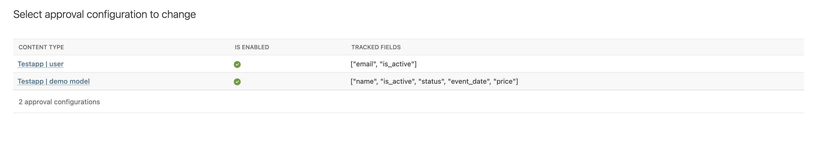
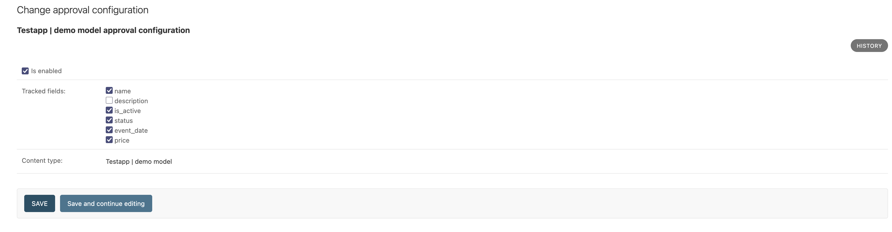
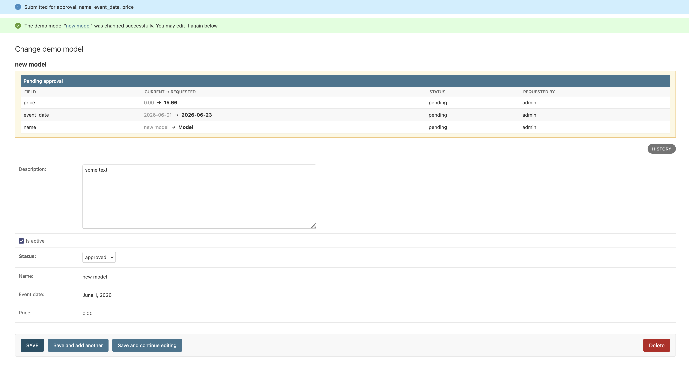
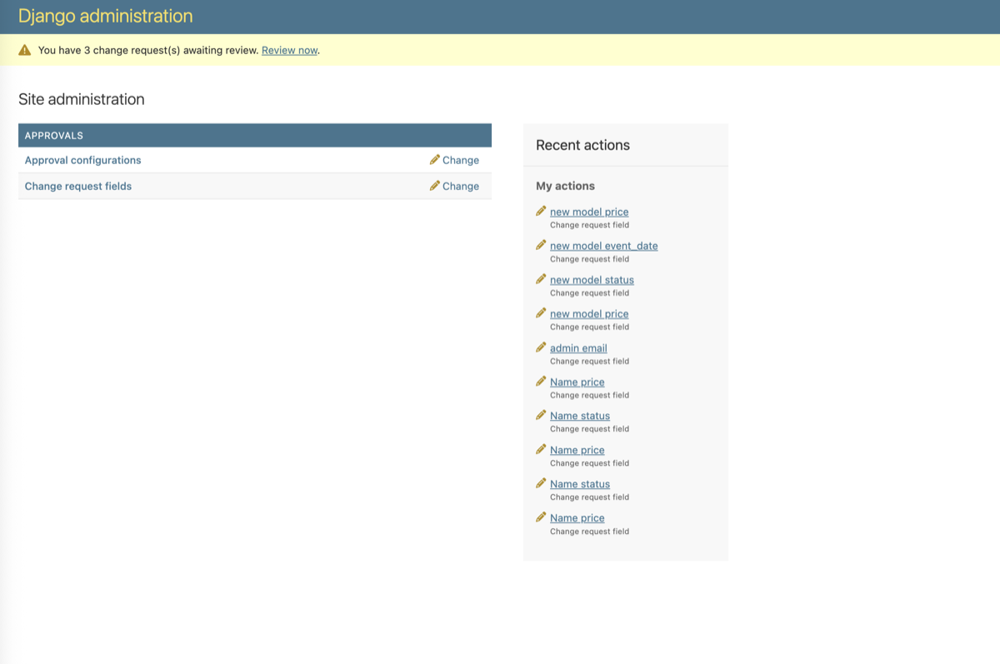
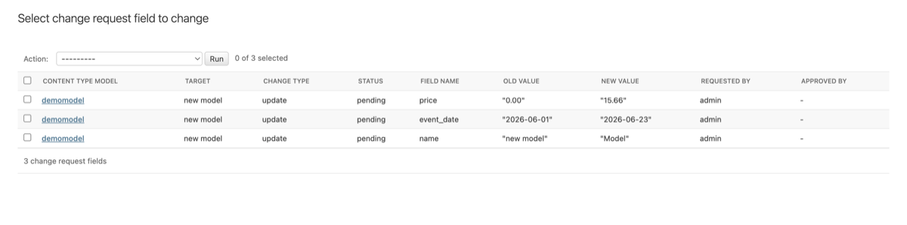

# django-approve

Moderated (four-eyes maker-checker) approval workflow for editing model fields through the Django admin.
An edit to a tracked field is not written immediately —
it is diverted into a `ChangeRequestField` row, the field is locked (read-only)
while the request is pending, and a reviewer approves or rejects it.

Granularity is per field, not per object: a single save that touches three
tracked fields creates three independent `ChangeRequestField` rows, each with
its own status and its own reviewer. There is no batch/"change set" model —
grouping is only a UX artifact (one "Submitted for approval: a, b, c" message).

## Installation

```bash
pip install django-approve
```

```python
INSTALLED_APPS = [
    "django.contrib.contenttypes",
    "django_approve",
]
```

Run `migrate` — this creates the `ApprovalConfig`/`ChangeRequestField` tables,
syncs an `ApprovalConfig` row per registered model, and creates the `Approvals`
group with `view`/`change` permissions on both models.

Optionally, add the middleware to show reviewers an "N change request(s)
awaiting review" banner on the admin index:

```python
MIDDLEWARE = [
    "django_approve.middlewares.PendingApprovalsNoticeMiddleware",
]
```

It only notifies on `GET /admin/` for active users in the `Approvals` group,
and only when there's at least one `pending` request.

## Usage

### 1. Register a model

```python
from django_approve.registry import register

@register
class Employee(models.Model):
    name = models.CharField(max_length=255)
    salary = models.DecimalField(max_digits=10, decimal_places=2)
    manager = models.ForeignKey("self", null=True, on_delete=models.SET_NULL)
```

Bare `@register` (no arguments, no `fields=`) makes *every* field on the
model a candidate except the ones that are always excluded: the primary key,
non-editable fields, `auto_now`/`auto_now_add` timestamps, and file/image
fields. To narrow the candidate set further, pass `fields`:

```python
@register(fields=["salary", "manager"])
class Employee(models.Model):
    ...
```

A field is eligible as a candidate when it is a concrete, editable field that
is not the primary key, not `auto_now`/`auto_now_add`, and not a `FileField`
(M2M and files are out of scope for v1). Candidates are intersected with the
`fields` whitelist above.

Registering only makes a field *eligible*; nothing is tracked yet.

### 2. Pick tracked fields in the admin

Each registered model gets an `ApprovalConfig` row (synced automatically on
`migrate`). In the `ApprovalConfig` admin, check which candidate fields should
actually go through the approval flow — this is `tracked_fields`, a subset of
the candidates. Rows can't be added/deleted manually; they only come from the
sync.

### 3. Add the admin mixin

```python
from django_approve import ApprovalAdminMixin

@admin.register(Employee)
class EmployeeAdmin(ApprovalAdminMixin, admin.ModelAdmin):
    ...
```

From here on, editing a tracked field through this admin no longer writes it
directly:

- The change is diverted into a `ChangeRequestField(status=pending)` with the
  old/new value serialized, and the in-memory value is reverted before saving.
  Untracked fields save normally in the same request.
- While a request is pending, `get_readonly_fields` locks that field and the
  change form shows a "Pending approval" block above it.
- A reviewer (member of the `Approvals` group) sees a banner on the admin
  index, then works through pending rows in the `ChangeRequestField`
  changelist — **Approve** or **Reject**, per field, independently. Both are
  also available as changelist bulk actions: select multiple pending rows and
  run **Approve selected** / **Reject selected** in one go.

See [Screenshots](#screenshots) below for what this looks like in the admin.

### Warning: locking only happens in the admin

The whole flow — diverting edits, locking fields, showing the pending block —
is implemented in `ApprovalAdminMixin`. Calling `.save()` on a model instance
from code (management commands, Celery tasks, shell, DRF) bypasses it
entirely and writes straight to the row. If you need the same guarantee
outside the admin, you have to call `apply_field` yourself or add your own
guard — there is currently no model-level enforcement.

## Statuses

| Status     | Meaning                                                                                                                              |
|------------| ------------------------------------------------------------------------------------------------------------------------------------ |
| `pending`  | Awaiting review. Field is locked.                                                                                                    |
| `approved` | Reviewer approved — applied to the target in the same atomic transaction as the status change. There is no separate "applied" state. |
| `rejected` | Reviewer declined the change. Reviewer-only verb.                                                                                    |
| `cancelled` | The request's author withdrew it. Author-only verb.                                                                                  |
| `deleted`  | The target object was deleted while the request was pending. Set automatically (`post_delete`); never offered as a manual choice.    |

A pending request can only move forward — a role restricts the status field
choices: the author can `cancel` but never `approve`/`reject` their own
request (when `APPROVE_REQUIRE_DIFFERENT_USER` is on, see below); a reviewer
can `approve`/`reject` but not `cancel` someone else's request.

If the target's current value no longer matches the request's recorded
`old_value` at approval time (someone else changed it in the meantime), the
approval fails with a `ConflictError` shown as an admin message — the request
stays `pending` and nothing is applied.

## Settings

All settings are optional; defaults are shown.

```python
APPROVE_AUTO_CREATE_GROUP = True       # create/maintain the Approvals group via post_migrate
APPROVE_GROUP_NAME = "Approvals"       # group name; membership = reviewer
APPROVE_REQUIRE_DIFFERENT_USER = True  # four-eyes: block self-approval (SelfApprovalError)
```

`APPROVE_AUTO_CREATE_GROUP` only controls whether the package manages the
group's permissions on `migrate`; it never adds/removes users from it.

## Supported field types (v1)

Scalars (including `date`/`Decimal`, serialized via `field.get_prep_value()`
and restored via `field.to_python()`) and `ForeignKey` (serialized as `.pk`,
restored via `related_model._base_manager.get(pk=...)` — raises
`ConflictError` instead of `DoesNotExist` if the target was deleted before
approval). M2M and file/image fields are out of scope for v1.

## Screenshots

<details>
<summary>ApprovalConfig: pick tracked fields per model</summary>




</details>

<details>
<summary>Locked field and pending-approval block on the change form</summary>



</details>

<details>
<summary>Reviewer: admin-index banner + ChangeRequestField changelist</summary>




</details>

## Development

```bash
poetry install
poetry run pytest
poetry run ruff check .
```
